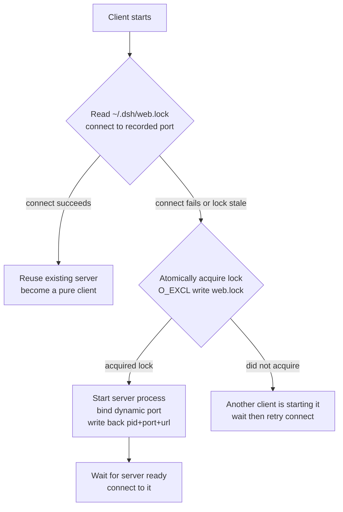
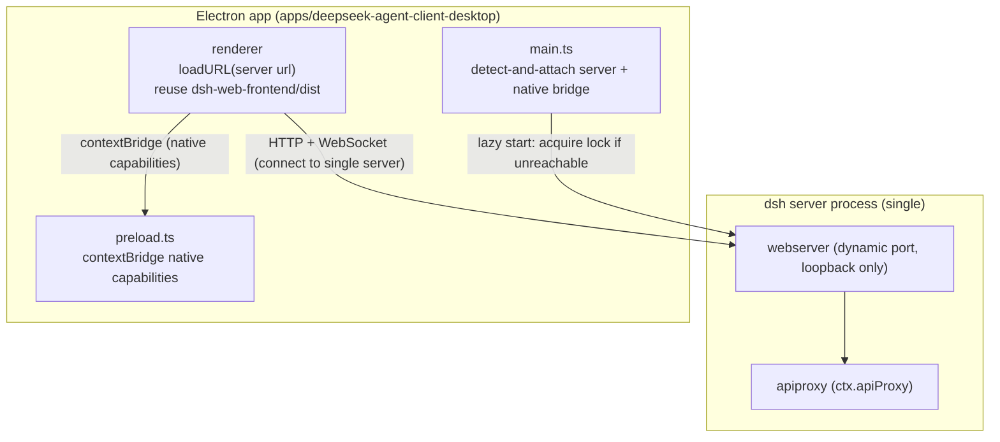
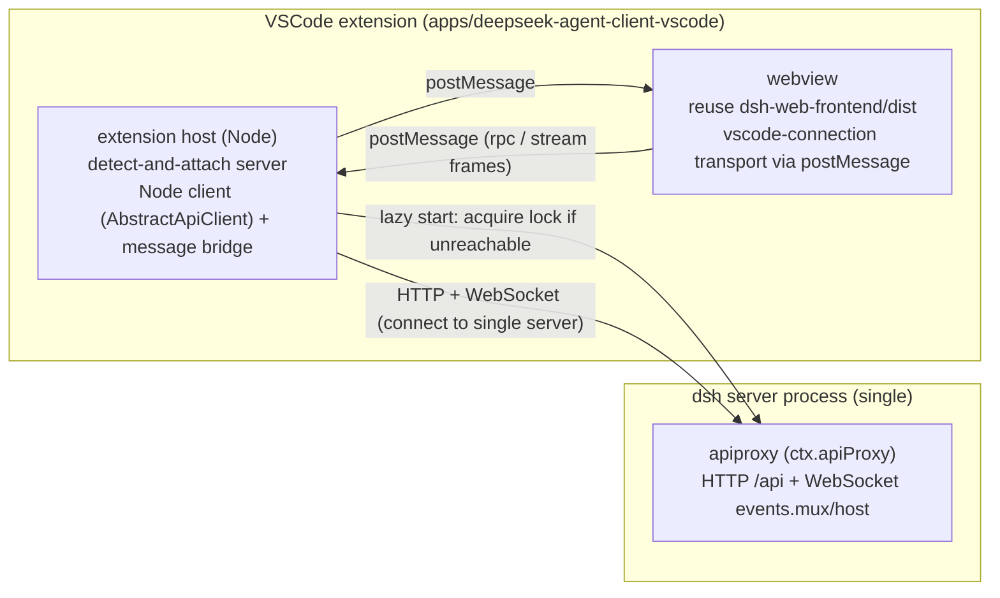

# DeepSeek Agent Client Transformation Design (Desktop + VSCode Extension)

English | [中文](desktop-and-vscode.zh.md)

Status: proposed (extended into an executable development plan; see "Executable Development Plan" at the end, which also corrects several statements in this document)

## Background and current state

`dsh` is a plugin-based agent harness split into two halves: Host and Client. The Host is the `dsh` service running in a Node process, exposing JSON-RPC methods through `apiproxy` (`ctx.apiProxy`); the Client is the React UI running in a browser (`packages/client/*`), bridging `apiproxy` to HTTP + WebSocket through the `connection` carrier. The repository currently ships only the web frontend (`apps/web` + `packages/bundle/web-app`); this design adds two more carriers beyond the web frontend: a desktop app and a VSCode extension, both under the unified brand **DeepSeek Agent Client**, distinguished by form-factor suffix — the desktop app is `DeepSeek Agent Client Desktop` and the VSCode extension is `DeepSeek Agent Client for VSCode`.

The three transformations share one design discipline: write the UI once, write the Host once, and make the transport pluggable. That discipline is already laid down in the current code, and four key reusable points keep the change small.

## Transformation principles

Three hard constraints govern every design trade-off:

1. **Zero change to core functionality.** The desktop and VSCode forms only swap the carrier (shell + transport); the core harness logic, agent loop, sessions, tools, and model adapters are untouched, and the existing web features are preserved in full with no removal or downgrade.
2. **Track upstream quickly.** This repository is a fork of `kuaizhongqiang/deepseek-harness`, so upstream updates must merge quickly. Changes are therefore minimal and isolated in additive layers: all new code lands in `apps/deepseek-agent-client-desktop`, `apps/deepseek-agent-client-vscode`, and the "single server" related new modules, avoiding changes to existing upstream `packages/` and `apps/`.
3. **Preserve all web features.** The desktop and VSCode forms reuse the same `dsh-web-frontend` output, so every feature the web frontend already has (sessions, model configuration, tools, settings, credentials) works fully in both forms; native capabilities (diff/terminal/dialog) are additive, not a replacement.

## Reusable surfaces

**The Host API gateway is transport-independent.** `apiproxy` (`ctx.apiProxy`) is the shared gateway; `toFetchHandler(apiProxy)` turns its JSON-RPC methods into an HTTP fetch handler, and `client/connection` is only one carrier that bridges it to HTTP + WebSocket. Swapping the transport means adding a carrier, without touching `apiproxy`.

**The frontend static output already exists.** `web-app` mounts the SPA via `@deepseek-ai/dsh-web-frontend/dist/index.html`; the desktop app and the VSCode webview reuse the same dist rather than maintaining a second UI.

**The Client boot already reserves a non-browser entry point.** The `seams` parameter of `AppWebEntry(el, seams?).run()` exists for environments where an external script cannot reach the page context; Electron `file://` and the VSCode webview both fall in that class. But `seams` only handles module loading (`loadBundle`); the transport swap point is `AbstractApiClient` (`doFetch`/`openMux`/`openHost`) and the `ctx.connection` plugin — see the corrections in the Executable Development Plan.

**The out-of-process driver protocol already exists.** `sdk/server` (stdio JSON-RPC server) + `sdk/client` (TypeScript client) exist specifically to drive the harness from another process, and `dsh-acp` already runs automation clients over stdio.

## Single server and single instance

The desktop app and the VSCode extension share one `dsh` server process, guaranteeing data interop and synchronization. The server is an independent process decoupled from its clients; it stays alive after all clients close, and sessions, logs, configuration, and credentials all live in that single process, so every client connecting to the same port shares them naturally.

The server's runtime data lives under the existing harness data root `~/.dsh` (reusing `dsh-home-paths`'s `resolveDshHome()`, no new directory). The lock file `~/.dsh/web.lock` is the server's identity, recording `{ pid, port, url }`, so a client can read it to learn the server's port and liveness.

The lock-file and lazy-start logic is implemented as an independent new module mounted through plugin composition, without modifying the upstream `dsh-host-webserver` and `dsh-web-app` source, to satisfy the "track upstream quickly" constraint.

### Startup and connect flow

Any client (desktop or VSCode) first tries to connect to the port recorded in the lock file:



Lazy start guarantees that whichever client starts first can bring up the server, without depending on whether the user installed the desktop app (a pure VSCode user works too).

### Single-instance guarantee

The lock file is the single arbitration point for single-instance:

- **Liveness check**: health-check the port recorded in the lock file; a response means the server is alive, and a stale PID (crashed process) is caught by the failed health check, after which the client takes over.
- **Takeover race**: when the desktop and VSCode both find the server absent at once, both write the lock file atomically (`O_EXCL`); whoever writes first owns it, and the other turns to attach. Reuses the atomic-write approach of `dsh-atomic-write`.
- **Dynamic port**: the server uses an OS-assigned port (`config.port: 0`) and writes the real port back to the lock file after startup; clients read the lock file for the port before connecting, avoiding a fixed port colliding with another program.

## Desktop: Electron shell + connect to the single server

### Desktop structure



### Key decision

Keep the local HTTP server instead of writing a custom IPC transport. Reason: `apiproxy`, `connection`, and the WebSocket downlink are all reused as-is with almost no new transport code; native capabilities (directory pick, path open, notifications, tray) are bridged separately through `contextBridge`, so no RPC transport needs to be rewritten.

### Main-process responsibilities

1. Connect to the single server: read `~/.dsh/web.lock` and connect to the recorded port; if unreachable, follow the "Single server and single instance" flow to acquire the lock and start it, then `loadURL(serverUrl)` after it is ready.
2. Window management: single instance, `BrowserWindow`, tray, menu.
3. Native capability bridge (`contextBridge`): `pickDirectory` reuses the `directory-picker-native` backend, `openPath` goes through main-process `shell.openPath`, plus notifications and the system tray.
4. Lifecycle: closing the desktop does not stop the server, only disconnects itself; the server's liveness is decided by the lock file and health check, shared with other clients.

### Packaging

Reuse `dsh-web-frontend/dist` as the bundled resource; `electron-builder` produces Windows (nsis) / macOS (dmg) / Linux (AppImage). The `dsh` CLI ships with the app (bundled at a pinned version).

### Desktop change list

| # | Change | Location |
| --- | --- | --- |
| 1 | `apps/deepseek-agent-client-desktop`: main / preload / builder config | new |
| 2 | Native capability contextBridge | new |
| 3 | Child spawn + readiness parsing + guarding | new |
| 4 | (optional) `server` profile composition (self-bootstrapped by the launcher, see the plan at the end) | bundle |
| 5 | CI packaging pipeline | new |

**Risks**: Electron size and memory; auto-update needs electron-updater; tray/multi-window session ownership must be explicit (default single window, single session).

## VSCode extension: full chat panel + native integration

Each VSCode window runs its own process in its extension host, each connecting to the same single server rather than spawning its own harness. Multiple VSCode windows and the desktop share sessions and data through the same server port.

### Structure



> Note: the shared server is a `web`-style HTTP server (apiproxy + webserver), not stdio JSON-RPC. The full chat panel needs the whole apiproxy surface (sessions/tools/settings/credentials); `sdk/server` exposes only `initialize`/`session/prompt`/`shutdown`, which cannot drive the chat UI.

### Backend driver: connect to the single server

On activation the extension reads `~/.dsh/web.lock` and connects to the single server; if unreachable, it follows the "Single server and single instance" flow to acquire the lock and start it. Each VSCode window's extension host is an independent process that only connects and bridges messages, and does not carry harness data; a crash affects only its own window, leaving the server and other windows untouched. The reason not to require in-process is that the Host side is ESM plus a plugin tree; in-process loading would drag down the extension host and lose isolation.

### Frontend: React chat panel in the webview

The webview loads the chat panel components from `dsh-web-frontend`. `seams` is not the transport injection point (it only handles `loadBundle`); transport replacement happens in `AbstractApiClient`'s `doFetch`/`openMux`/`openHost` and at the `ctx.connection` plugin layer — the webview uses a `vscode-connection` plugin built on `acquireVsCodeApi().postMessage` to replace browser fetch/WebSocket. The key effort is webview CSP adaptation (no inline scripts, requires `Content-Security-Policy`) and de-inlining the boot manifest (it is currently injected as an inline `<script>`, which CSP blocks; it must become a `<script type="application/json">` plus an external loader).

### Native integration (done together in M2)

On top of the full chat panel, wire native capabilities by bridging existing Host capabilities through the extension:

- **diff**: dsh edit/str_replace results drive the VSCode diff editor (`vscode.diff` command).
- **terminal**: dsh's PTY backend maps to the VSCode `Pseudoterminal`.
- **diagnostics**: the dsh `lsp` package consumes VSCode TS diagnostics.
- **directory pick**: reuse VSCode's native `showOpenDialog` instead of `directory-picker-browse`.

### Change list

| # | Change | Location |
| --- | --- | --- |
| 1 | `apps/deepseek-agent-client-vscode`: extension host + webview loader + message bridge | new |
| 2 | server lock detection + lock acquisition + connect (detect-and-attach) | new |
| 3 | webview CSP adaptation + boot-manifest de-inlining + `vscode-connection` transport | reuse client + adapt |
| 4 | native capability bridge (diff/terminal/dialog) | new |
| 5 | vsce packaging + CI | new |

**Risks**: bundling the ESM-only harness into the extension; webview CSP details; sidebar narrow-screen layout adaptation; concurrent lock acquisition across multiple VSCode windows must start only one server.

## Remote centralization (deferred)

Deferred by decision. Only the architectural reservation remains: the core is to add an authentication layer to the `/api` trust fence (currently "a reachability policy, not authentication"), then upgrade the privileged method set from loopback-only to authenticated-only. The transport abstraction is already in place (`apiproxy` is transport-independent); at that point it is only a matter of adding a TLS + token carrier, without touching the UI and agent logic. It becomes a separate project later.

## Milestones

| Order | Item | Reason |
| --- | --- | --- |
| M1 | Single-server mechanism (lock file + lazy start + single instance) | the prerequisite shared by desktop and VSCode; lay the data-interop foundation first |
| M2 | VSCode extension (connect to single server + full chat panel + native integration) | highest-frequency IDE scenario; validates "webview reuses dist + custom transport carrier + extension-host bridge"; the transport abstraction lands here (not sdk/server) |
| M3 | Desktop (Electron shell + connect to single server + native bridge) | reuse the same dist, apply the transport abstraction validated in M2 |
| M4 | (deferred) remote centralization authentication layer | separate project |

## Risks and decision points

The trade-off of decoupling the single server from its clients is "adding lock-file and lazy-start complexity" in exchange for desktop/VSCode data interop, an independently surviving server, and multi-window shared sessions. The lock file's liveness check (health check catching stale PIDs) and takeover race (atomic lock acquisition) are correctness-critical and need test coverage for concurrent startup.

The desktop trade-off of keeping the local HTTP server is "give up the cleanliness of a custom IPC transport in exchange for full reuse of `apiproxy`/`connection`/WebSocket". If the HTTP server layer must be removed later, a custom IPC carrier is required (more work but cleaner); this design does not adopt it now.

The trade-off of doing VSCode native integration in M2 is "a larger M2 deliverable", but diff/terminal/dialog are what make the full chat panel truly integrate into the IDE; splitting them into a later milestone would ship the UI first and then rework the bridge.

---

## Executable Development Plan

> This section expands the design above into an implementation-ready plan: new packages and files, core algorithms and protocols, acceptance criteria and tests. It opens with the evaluation conclusions and factual corrections to the original design. Milestones keep the numbering above: M1 = single server, M2 = VSCode, M3 = Desktop.

## 0. Evaluation: the design holds; four facts need correction

Exploring the repository confirms the core reusable surfaces in the design all exist:

- `apiproxy` is transport-independent: `toFetchHandler(apiProxy)` ([packages/host/apiproxy/src/fetch/handler.ts](../../packages/host/apiproxy/src/fetch/handler.ts)) turns its JSON-RPC methods into a `{ fetch }`, and `InProcessApiClient` ([packages/host/apiproxy/src/fetch/client.ts:520](../../packages/host/apiproxy/src/fetch/client.ts#L520)) demonstrates the "never touches the network" subclass pattern.
- `client/connection` bridges `/api` (HTTP uplink) + `/api/events.mux`, `/api/events.host` (WebSocket downlink); swapping the transport means adding a carrier, without touching `apiproxy`.
- `dsh-web-frontend` dist is served by `frontend-static`; `host.pickDirectory`/`host.openPath` are already usable RPCs on loopback (`PRIVILEGED_METHODS`, [packages/client/connection/src/index.ts:89](../../packages/client/connection/src/index.ts#L89)).
- `resolveDshHome()`/`dshHomePath()` ([packages/util/home-paths/src/index.ts:87](../../packages/util/home-paths/src/index.ts#L87)) and the `wx` O_EXCL pattern in `writeFileAtomic`/`withFileLock` ([packages/util/atomic-write/src/index.ts](../../packages/util/atomic-write/src/index.ts)) are ready-made infrastructure.

Four statements in the design disagree with the code and must be corrected during implementation:

1. **`seams` is not the transport injection point.** The `seams` type of `AppWebEntry(el, seams?)` is `Pick<ClientModuleSystemOptions, 'loadBundle'>` ([packages/client/web/src/boot.tsx:51](../../packages/client/web/src/boot.tsx#L51)) — it only handles client-module bundle loading, **not** fetch/WebSocket. The real transport swap points are `AbstractApiClient`'s `doFetch`/`openMux`/`openHost` ([packages/host/apiproxy/src/fetch/client.ts:244](../../packages/host/apiproxy/src/fetch/client.ts#L244)) and the `ctx.connection` client plugin that selects `WebApiClient`. Injecting a custom transport into the webview means "replacing the connection plugin row + rewriting the boot manifest", not `seams`.
2. **There is no ready-made health-check endpoint.** The webserver only does routing ([packages/host/webserver/src/index.ts](../../packages/host/webserver/src/index.ts)); readiness is determined client-side by `host.describe` + both streams' `onOpen` ([packages/client/connection/src/client/connection.ts:133](../../packages/client/connection/src/client/connection.ts#L133)). The lock file's "health check" must be implemented as `POST /api/host.describe` (a 200 response means alive).
3. **There is no daemon / PID / port-ping infrastructure.** `writeFileAtomic` always overwrites (no "fail if exists"); an exclusive claim needs `writeFile(..., { flag: 'wx' })` directly; background hosting needs a self-built detached spawn.
4. **`sdk/server` cannot drive the full chat UI.** `HarnessSdkJsonRpcServer` exposes only `initialize`/`session/prompt`/`shutdown` ([packages/sdk/protocol/src/types.ts:101](../../packages/sdk/protocol/src/types.ts#L101)), far smaller than the apiproxy surface of sessions/tools/settings/credentials; and `HarnessClient` can only `spawn`, it **cannot attach** to an existing server. M2 must therefore be: the shared server is still a `web`-style HTTP server, and the webview's transport is "bridged through the extension host" (not "the extension host spins up its own harness via sdk/server").

Three more facts to know before implementation:

- **The boot manifest is injected as an inline `<script>`** ([packages/client/modules/src/index.ts:170](../../packages/client/modules/src/index.ts#L170)). The web side injects `window.__DSH_BOOT__` via `webServer.tapIndex` on every serve of index.html. VSCode webview CSP forbids inline scripts, so the manifest must be injected as `<script type="application/json">` plus an external loader.
- **Client-module bundles are served at `/plugins/<id>/client.js`** (a `/plugins` prefix route, [packages/client/modules/src/index.ts:242](../../packages/client/modules/src/index.ts#L242)). In the webview these relative URLs must be rewritten to server-absolute URLs.
- **`WebApiClient` uses a relative `/api`** ([packages/client/connection/src/client/web-api-client.ts:13](../../packages/client/connection/src/client/web-api-client.ts#L13)). Under Electron `loadURL` the page origin is the server, so it works; a VSCode webview's origin is `vscode-webview://`, where the relative path breaks — this is the root reason the webview transport must be custom.

> These corrections are recorded durably in the Agent Note: [2026-08-14-desktop-vscode-transport-facts](../../.agents/notes/proposed/architecture/2026-08-14-desktop-vscode-transport-facts.md).

## 1. New components overview

| Kind | Package / directory | Responsibility | Depends on |
| --- | --- | --- | --- |
| new | `packages/server/server-single-instance` → `@deepseek-ai/dsh-server-single-instance` | server side: write `{version,pid,port,url}` back to `~/.dsh/web.lock` after listen; delete on dispose | `dsh-home-paths`, `dsh-atomic-write`, `dsh-host-webserver` |
| new | `packages/server/server-launcher` → `@deepseek-ai/dsh-server-launcher` | client side: read lock / health check / `wx` claim / detached spawn / wait for publish / attach | `dsh-home-paths`, `dsh-atomic-write` |
| new | `packages/bundle/server-app` → `@deepseek-ai/dsh-server-app` | bundle: insert the `server-single-instance` row, pin `host: 127.0.0.1`, `port: 0`, disable `printUrl` | base + web-app + server-single-instance |
| new | `apps/deepseek-agent-client-desktop` → `@deepseek-ai/dsh-deepseek-agent-client-desktop` | Electron shell: detect-and-attach + loadURL + native bridge | launcher, electron, electron-builder |
| new | `apps/deepseek-agent-client-vscode` → `@deepseek-ai/dsh-deepseek-agent-client-vscode` | VSCode extension: detect-and-attach + webview bootstrap + native integration | launcher, `dsh-host-apiproxy`(AbstractApiClient), `ws` |
| minimal | `packages/client/connection` (optional; only for the dropped direct path) | if "webview direct" were kept, add a `window.__DSH_API_BASE__` read to `WebApiClient` | upstream package |

All new code lands in new directories; the `packages/client/connection` change is an optional minimal delta, satisfying the "track upstream quickly" constraint.

## 2. Phase M1: single-server mechanism

### 2.1 Lock file protocol

`~/.dsh/web.lock`, JSON, `version: 1`:

```ts
interface ServerLockV1 {
  version: 1
  pid: number          // server pid after publish; claimer's pid during claim
  port: number | null  // null = claimed but not yet published
  url: string | null   // http://127.0.0.1:<port>
}
```

Resolved via `dshHomePath('web.lock')`, so it naturally follows `$DSH_HOME` overrides (tests can point `DSH_HOME` at a temp dir).

### 2.2 Server-side plugin `dsh-server-single-instance`

- `name = 'server-single-instance'`, `inject: ['webServer']`, `Config: { lockFile?: string }` (default `dshHomePath('web.lock')`).
- **Publish timing**: mirror web-app's `printUrl` ([packages/bundle/web-app/src/index.ts:159](../../packages/bundle/web-app/src/index.ts#L159)) — after `ctx.get('loader')?.await()` settles (the Loader tree is ready, including the webserver bind), read `ctx.webServer.port` and write the lock:

```ts
const lock: ServerLockV1 = {
  version: 1,
  pid: process.pid,
  port: ctx.webServer.port,
  url: `http://127.0.0.1:${ctx.webServer.port}`,
}
await writeFileAtomic(lockFile, JSON.stringify(lock), { mode: 0o600 })
```

- **Cleanup**: `ctx.on('dispose', () => void unlink(lockFile).catch(() => {}))` (delete on graceful shutdown; a hard crash is caught by the health check and taken over).
- Use `writeFileAtomic` (overwrite): publish replaces the claim placeholder; it is not "fail if exists".

### 2.3 Client-side `dsh-server-launcher`: detect-and-attach

Exports:

```ts
interface EnsureServerResult { url: string; port: number; pid: number; attached: boolean }
ensureServer(opts: {
  command: string[]               // e.g. ['dsh', '--profile', 'server', '--port', '0']
  cwd?: string
  logFile?: string                // default ~/.dsh/logs/server.log (the launcher creates the dir)
  claimTimeoutMs?: number         // default 30_000
}): Promise<EnsureServerResult>
```

Core algorithm (the correctness key is "health-check first, then decide to take over"):

```text
loop (at most 15 times):
  lock = readLock()
  if lock and lock.port != null and lock.url is set:
      if checkServer(lock.url) succeeds → return attach(lock)        # reuse a live server
      # port set but health check failed → server crashed/hung → take over
  elif lock and lock.port == null:
      sleep(200); continue                                            # someone is claiming; wait for publish
  if lock and health check failed:
      unlinkIfOwned(lock)                                             # take over: clear the stale lock
  claimed = writeClaim(LOCK)     # writeFile(LOCK, {pid:claimerPid, port:null, url:null}, {flag:'wx', mode:0o600})
  if claimed failed (EEXIST):
      sleep(150); continue                                            # lost the race → retry attach next round
  try:
      spawnDetached(command, logFile)
      published = waitForPublish(LOCK, claimTimeoutMs)                # poll until port set and checkServer ok
      if published → return attach(published)
      throw Error('server failed to start')
  catch e:
      releaseOwnedLock(LOCK, claimedPid)                              # unlink only if the lock pid is still ours
      throw e
throw Error('cannot acquire server lock')
```

Helpers:

- `checkServer(url)` = `fetch(url + '/api/host.describe', { method: 'POST', headers: { 'content-type': 'application/json' }, body: '{}', signal: AbortSignal.timeout(500) })`, `res.ok` means alive.
- `spawnDetached` = `spawn(cmd[0], cmd.slice(1), { detached: true, stdio: ['ignore', fd, fd], cwd, windowsHide: true })` + `child.unref()`; `fd` is an append handle to `logFile`. `detached + unref` keeps the server alive after its parent exits on both POSIX and Windows (`windowsHide` prevents a console flash on Windows).
- `waitForPublish` reads the lock every 200ms: returns once `port != null && checkServer(url)`; throws on timeout.

### 2.4 `dsh-server-app` bundle and `server` profile

- `packages/bundle/server-app/cordis.patch.yml`: `- insert:` one `server-single-instance` row (`@deepseek-ai/dsh-server-single-instance`); pin the `webserver` row's `host` to `127.0.0.1` and `port` to `0`; turn off web-app's `printUrl`.
- On first run the launcher self-bootstraps the profile: writes `$DSH_HOME/profiles/server/package.json` (`dsh.profile.bundles: ['@deepseek-ai/dsh-base', '@deepseek-ai/dsh-web-app', '@deepseek-ai/dsh-server-app']`). Same file-writing behavior as `initProfile` ([packages/boot/app-boot/src/profile.ts:152](../../packages/boot/app-boot/src/profile.ts#L152)); `PROFILE_TEMPLATES` upstream is untouched. Named `server` (not `desktop`) to avoid colliding with the product name "DeepSeek Agent Client Desktop".
- So `ensureServer({ command: ['dsh', '--profile', 'server', '--port', '0'] })` boots a tree of base + web-app + server-app, data under `~/.dsh`, bound to a dynamic loopback port, publishing to `web.lock`.

### 2.5 Lifecycle and single-instance guarantees

- The server is decoupled from its clients: detached spawn + unref keeps it alive after all clients close.
- Takeover race: the `wx` exclusive write is the single arbitration point; concurrent claimers succeed exactly one, the rest enter the attach poll.
- Stale-PID fallback: **use the failed health check** (not PID probing) as the takeover basis, avoiding Windows `process.kill(pid,0)` EPERM / PID-reuse misjudgments.
- Optional: idle auto-shutdown (e.g. dispose and delete the lock after 30 minutes with no connection) — a `Config` option, off by default to honor "the server survives independently".

### 2.6 M1 acceptance criteria and tests

- **Concurrent-claim test**: with a temp `DSH_HOME`, spawn N (≥4) child processes running `ensureServer` at once; assert exactly one claim succeeds, the rest attach to the same URL, and the lock's pid is the server pid.
- **Takeover test**: start a server → health check ok → hard-kill the server → the next client takes over (clears the stale lock → starts a new server).
- **Dynamic-port test**: `port: 0`; after publish the lock's port is the real port and `checkServer` passes.
- **Lifecycle test**: start a server → all clients close → the server process is still alive; on graceful dispose the lock is removed.
- **CI gate**: new `packages/server/*/src` must hit per-file 100% `test:coverage` (repo CI gate); concurrency tests use real child processes, no real API.

## 3. Phase M2: VSCode extension

### 3.1 Directory and files

```text
apps/deepseek-agent-client-vscode/
  package.json                # engines.vscode, contributes(views/commands/activationEvents), main: dist/extension.js, type: module, private
  src/extension.ts            # activate: ensureServer + WebviewViewProvider registration + native listeners
  src/server-client.ts        # extension-host Node client: extends AbstractApiClient (doFetch/openMux/openHost over http+ws)
  src/webview-boot.ts         # fetch server index.html → rewrite → inject manifest → build webview html + CSP
  src/native/diff.ts          # session/event tool/result (str_replace/diff) → vscode.diff
  src/native/terminal.ts      # PTY events → vscode.Pseudoterminal
  src/native/dialog.ts        # host.pickDirectory → vscode.window.showOpenDialog (optional refinement)
  src/native/diagnostics.ts   # packages/lsp consuming VSCode TS diagnostics (stretch, see 3.5)
  resources/webview/boot-loader.js      # classic script: read #dsh-boot → window.__DSH_BOOT__, then the SPA shell runs
  resources/webview/vscode-connection.js # client plugin bundle: acquireVsCodeApi().postMessage as the transport
  esbuild.config.mjs / tsconfig.json
```

### 3.2 Extension host: detect-and-attach + message bridge

- `activate`: `const { url, port } = await ensureServer({ command: ['dsh', '--profile', 'server', '--port', '0'] })`, register a `WebviewViewProvider` (sidebar chat panel) + commands.
- **Node server client** (`src/server-client.ts`): `class VsCodeServerClient extends AbstractApiClient`, `doFetch` via Node `fetch` against `url + path`, `openMux`/`openHost` via `ws` to `ws://127.0.0.1:<port>/api/events.mux` and `/api/events.host`. Reuses the protocol invariants of [packages/host/apiproxy/src/fetch/client.ts:244](../../packages/host/apiproxy/src/fetch/client.ts#L244) (RPC envelope, error codes, timeouts) with no rewrite.
- **Message bridge**: the webview `postMessage`s to the EH, which relays to the server client; server downlink frames (mux/host) are broadcast back to the webview. The envelope is isomorphic on both sides:

```ts
// webview → EH
type VsMsgReq = { kind: 'rpc'; rpcId: string; method: string; payload: unknown }
type VsMsgSub = { kind: 'subscribe'; stream: 'mux' | 'host' }
// EH → webview
type VsMsgRes = { kind: 'rpc-reply'; rpcId: string; ok: true; result: unknown }
              | { kind: 'rpc-reply'; rpcId: string; ok: false; error: unknown }
type VsMsgFrame = { kind: 'frame'; stream: 'mux' | 'host'; frame: unknown }   // MuxFrame | HostFrame
type VsMsgState = { kind: 'state'; connected: boolean; description: string; loopback: boolean }
```

- Readiness semantics: after the EH completes `host.describe` + both streams' `onOpen` (same as `ConnectionController`), it sends `VsMsgState{connected:true}`; the webview's `vscode-connection` plugin resolves `start()` from that.

### 3.3 Webview bootstrap: HTML rewrite + manifest injection + CSP

The webview cannot `loadURL` a remote page, so the extension fetches the same SPA from the server, rewrites it, and feeds it to `webview.html`:

1. `fetch(url)` gets the server-rendered index.html — already carrying the inline boot manifest injected by `tapIndex`.
2. **De-inline the manifest**: replace `<script>window.__DSH_BOOT__ = {...}</script>` with `<script type="application/json" id="dsh-boot">...</script>` (non-executable, CSP does not block it); point the `connection` (and other transport) plugin rows' bundle URLs at `vscode-connection.js` (asWebviewUri).
3. **Resource rewrite (decision: scripts served by the server)**: rewrite the relative URLs of the Vite output `/assets/*` and `/plugins/<id>/client.js` to server-absolute `http://127.0.0.1:<port>/...`. Do **not** package the client-module graph into the vsix (avoids version skew with the server's plugin set); `loadBundle`'s default `<script src=absolute-url>` works as-is (classic-script cross-origin loads have no CORS restriction).
4. **Prepend the loader**: insert `<script src="vscode-webview-resource://.../boot-loader.js">` in `<head>` (external script, CSP allows it); it reads `#dsh-boot` synchronously and sets `window.__DSH_BOOT__`. A classic script runs before deferred modules, so `AppWebEntry.run()` sees the manifest.
5. **CSP (hybrid: bridged transport + server-served scripts)**: the data plane (RPC + mux/host streams) all goes through postMessage, so `connect-src` allows no http; the script plane opens loopback so `/assets/*` and `/plugins/*` load from the server:

```text
default-src 'none';
script-src 'vscode-webview-resource:' http://127.0.0.1:*;
style-src 'unsafe-inline' 'vscode-webview-resource:' http://127.0.0.1:*;
img-src 'vscode-webview-resource:' http://127.0.0.1:* data:;
font-src 'vscode-webview-resource:' http://127.0.0.1:* data:;
connect-src 'vscode-webview-resource:';   # data plane still fully bridged; no http allowed
frame-src 'none'
```

`seams`'s actual role in M2: `AppWebEntry(el, { loadBundle })`'s `loadBundle` hands the manifest's server-absolute URLs to the default `<script src>` behavior (the default already supports absolute URLs). The real new code is the `vscode-connection` plugin (transport), not `seams`.

### 3.4 Transport: confirmed "extension-host bridge"; direct connection dropped

| Option | Data-plane CSP | Script plane | New code | CORS | Notes |
| --- | --- | --- | --- | --- | --- |
| **Bridge (confirmed)** | `connect-src 'vscode-webview-resource:'` (no http) | `/plugins/*`, `/assets/*` rewritten to server-absolute URLs; `script-src http://127.0.0.1:*` | EH Node client + message bridge + `vscode-connection` plugin | none (EH has no origin restriction) | data all via postMessage; scripts served by the server; no client-module graph in the vsix |
| Direct (dropped) | needs `http://127.0.0.1:*` + `ws://127.0.0.1:*` | same | small (apiBase + HTML rewrite only) | **needs server CORS headers** | requires upstream CORS |

Bridge is confirmed (decision, 2026-08). The data plane (RPC + mux/host streams) all goes through `postMessage`; the webview issues no cross-origin data requests and `connect-src` stays tight. The script plane is served by the server (`/plugins/*`, `/assets/*` rewritten to absolute URLs; classic-script cross-origin loads have no CORS restriction), avoiding packaging the whole client-module graph into the vsix and its version skew. The direct path, the `WebApiClient` apiBase change it needs ([packages/client/connection/src/client/web-api-client.ts:13](../../packages/client/connection/src/client/web-api-client.ts#L13)), and server CORS are all dropped.

### 3.5 Native integration

The EH already holds the mux downlink (to forward to the webview); it listens on the **same stream** and localizes:

- **diff**: `tool/result` (str_replace read/replace results, deliverables) → collect changed paths → open via `vscode.diff`.
- **terminal**: dsh PTY backends (`packages/shell`/`packages/terminal`) terminal events → `vscode.window.createTerminal({ pty })` `Pseudoterminal` forwarding output/input.
- **dialog**: `host.pickDirectory` already works through the bridge; "replace with VSCode `showOpenDialog`" is an incremental refinement (intercept that RPC and have the EH pop the native dialog directly).
- **diagnostics**: `packages/lsp` consuming VSCode TS diagnostics — the thinnest, most dependency-heavy slice of this phase; do a spike first (read `packages/lsp` interfaces), **stretch, does not block M2 acceptance**; the design lists it alongside diff/terminal, but implement it as a separate deliverable.

### 3.6 vsce packaging and CI

- `vsce package`; bundle the ESM-only harness into the extension (esbuild/tsup, matching the repo's `tsup` pipeline).
- Resources: ship a pinned `dsh` CLI (same source as desktop) for `ensureServer`; package `resources/webview/*` too.
- CI: `vsce package` + smoke on a clean `DSH_HOME` (without a real API key, verify the UI starts and connects to the server).

### 3.7 M2 acceptance criteria

- Install the vsix → open the chat panel in the sidebar → create a session, send prompts, call tools, and use the model-configuration/settings/credentials panels end to end (proving the whole apiproxy surface works through the bridge).
- str_replace produces a diff; PTY shows up in a VSCode terminal.
- Two VSCode windows concurrently → exactly one server, shared sessions; VSCode + desktop share one server.
- The webview has no inline scripts and the CSP is enforced.

## 4. Phase M3: Electron desktop

### 4.1 Directory and files

```text
apps/deepseek-agent-client-desktop/
  package.json          # main: lib/main.js, type: module, electron/electron-builder devDeps, private
  src/main.ts           # app.requestSingleInstanceLock, ensureServer, BrowserWindow, tray/menu, lifecycle
  src/preload.ts        # contextBridge: window/tray/notification/platform only; openPath/pickDirectory work over HTTP already
  src/log.ts / src/tray.ts
  electron-builder.yml  # nsis/dmg/AppImage, extraResources: bundled dsh CLI
```

### 4.2 Key points

- **renderer = `loadURL(serverUrl)`**: the page origin is the server, so `WebApiClient`'s relative `/api` works and every web feature works with zero changes. This is the lightest of the three forms.
- **Minimal native bridge**: `host.pickDirectory`/`host.openPath` are already loopback RPCs (`PRIVILEGED_METHODS`), no need to redo them in contextBridge. The preload only exposes window/tray/notification/platform (`contextIsolation: true, nodeIntegration: false, sandbox: false`).
- **Lifecycle**: closing the window / `before-quit` does not kill the server (desktop only attaches); "on quit, stop the server if this instance started it and no other client remains" is not done in v1.
- **Navigation guard**: `will-navigate`/`setWindowOpenHandler` allow only the server origin, preventing navigation away from `loadURL`.
- **Packaging**: `electron-builder` targets all three platforms; `extraResources` ships the pinned `dsh` CLI (same source as VSCode), which `ensureServer` resolves; dev mode uses the repo's `pnpm dsh`.

### 4.3 M3 acceptance criteria

- Install → launch → the server lazily starts (lock file appears) → the UI loads fully; quit leaves the server running; relaunch attaches without starting a second server.
- A second instance focuses the existing window; concurrent VSCode launch starts only one server.
- Packaged artifacts run on all three platforms on the CI matrix.

## 5. Order and dependencies

M1 is the prerequisite for M2/M3 (lock file + lazy start + single instance). M2 comes before M3: M2 validates "webview reuses dist + custom transport carrier + EH bridge", and M3 is nearly free (`loadURL`). Inside M2, do 3.2/3.3 (chat panel usable) before 3.5 (native integration), honoring the design's "native integration in M2" but splitting it into two independently shippable landing points to avoid one oversized delivery.

## 6. Repository-level constraints

- **`test:coverage` gate**: new `packages/server/*/src` must hit per-file 100% coverage (CI gate); M1's lock/takeover/concurrency tests must satisfy it. `apps/*` is not gated.
- **Agent Note**: each M1/M2/M3 PR needs an Agent Note ([.agents/notes/README.md](../../.agents/notes/README.md)); read [docs/architecture.md](../../docs/architecture.md) before changing `packages/`.
- **Model-visible ⟺ logged**: this plan adds no model-visible surface, only moves transport; native diff/terminal only consume existing `tool/result`/terminal events, adding no session events.
- **hygiene**: new packages must pass `pnpm run hygiene` (knip/publint/workspace constraints/NodeNext); the vsce extension package is not an npm-consumable artifact and may need a knip exemption (same approach as apps/web).
- **snapshot**: no model-visible behavior change, so no keyless snapshot obligation.
- **Release cadence**: land M1/M2 as `private: true` inside the fork first; new packages are isolated and merge cleanly.

## 7. Risk register and decisions

| # | Risk / issue | Impact | Mitigation |
| --- | --- | --- | --- |
| 1 | webview forbids inline scripts → boot-manifest injection | blocks M2 | `<script type="application/json">` + external loader (path in 3.3) |
| 2 | `vscode-webview://` cross-origin CORS | avoided | bridge completely sidesteps it: data plane all via postMessage, no CORS |
| 3 | bundling the ESM-only harness into a vsce bundle | M2 packaging | esbuild/tsup single file; `AbstractApiClient` is pure Node with no DOM dependency |
| 4 | locating the `dsh` CLI (dev/prod) | M2/M3 | `ensureServer.command` configurable + bundled pinned-version resolution |
| 5 | unclear scope of `packages/lsp` diagnostics integration | M2.2 stretch | spike first; allow shipping separately |
| 6 | lock-file health-check misjudgment (slow server start) | M1 correctness | `waitForPublish` timeout + fail-to-cleanup; health check `host.describe` with 500ms timeout |
| 7 | resource cost of a permanently resident server | ops | `Config.idleShutdownMs` (optional auto-shutdown), off by default |
| 8 | tray/multi-window session ownership | M3 | v1 single window, single session (the design's stated default) |

**Decided** (2026-08):

- **Transport: bridge.** The data plane (RPC + mux/host streams) all goes through `postMessage`; the webview never connects to the server directly.
- **Scripts: served by the server.** The manifest's `/plugins/*` and `/assets/*` are rewritten to server-absolute URLs; `loadBundle` uses the default `<script src>`; the client-module graph is not packaged into the vsix, avoiding version skew with the server's plugin set. `script-src` opens `http://127.0.0.1:*`; `connect-src` stays closed (data still bridged).
- **Profile named `server`.** The launcher self-bootstraps `$DSH_HOME/profiles/server` (bundles: base + web-app + server-app), avoiding the product-name collision; the design's "(optional) `profile desktop` composition" lands as this.
- **New `packages/server/` group.** Hosts `server-single-instance` and `server-launcher`.
