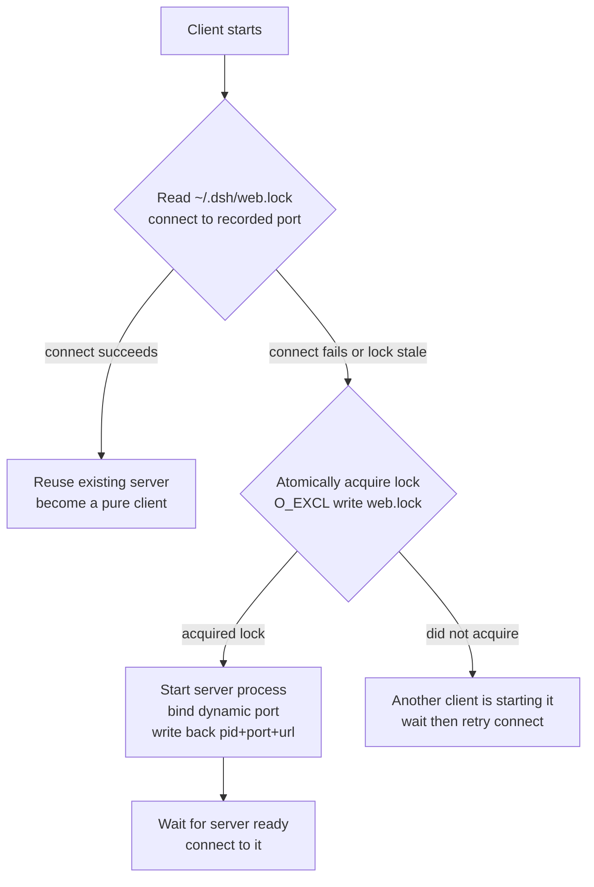
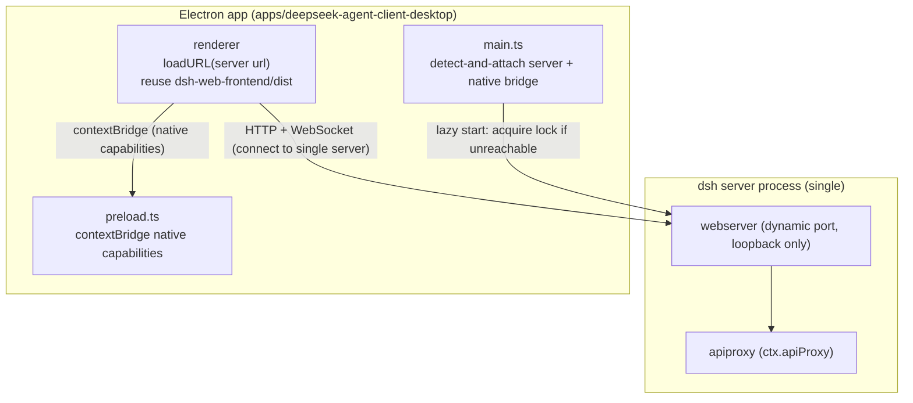
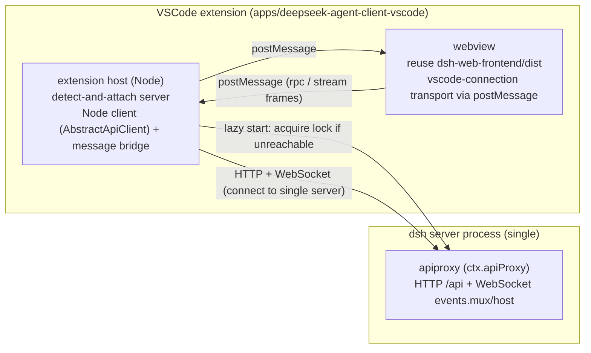

# DeepSeek Agent Client 改造设计（桌面端 + VSCode 插件）

中文 | [English](desktop-and-vscode.md)

状态：proposed（已扩展为可执行开发方案，见文末《可执行开发方案》一节；方案对本文档若干表述做了事实修正）

## 背景与现状

`dsh` 是一个插件化 agent harness，架构上分为 Host 与 Client 两段。Host 是运行在 Node 进程中的 `dsh` 服务，通过 `apiproxy`（`ctx.apiProxy`）暴露 JSON-RPC 方法；Client 是浏览器中运行的 React UI（`packages/client/*`），通过 `connection` 载体把 `apiproxy` 桥接到 HTTP + WebSocket。当前仓库只交付了 web 端（`apps/web` + `packages/bundle/web-app`），本设计在 web 端之外新增两个载体：桌面端与 VSCode 插件，二者统一品牌名为 **DeepSeek Agent Client**，以形态后缀区分——桌面端为 `DeepSeek Agent Client Desktop`，VSCode 插件为 `DeepSeek Agent Client for VSCode`。

三个改造共享一条设计纪律：UI 写一份、Host 写一份、传输层（transport）可插拔。这个纪律在现有代码里已经铺好，四个关键可复用点决定了改造量很小。

## 改造原则

本改造的三条硬性约束，决定所有设计取舍：

1. **核心功能零改动**。desktop 与 vscode 只是换载体（壳 + transport），核心 harness 逻辑、agent 循环、会话、工具、模型适配器一律不改；现有 web 的功能被完整保留，不做删减或降级。
2. **快速跟上上游**。本仓库是 `kuaizhongqiang/deepseek-harness` fork，上游更新后要能快速 merge。因此改动必须最小化且隔离在新增层：所有新增代码落在 `apps/deepseek-agent-client-desktop`、`apps/deepseek-agent-client-vscode` 以及「唯一 server」相关的新增模块，尽量避免触碰上游已有 `packages/` 与 `apps/`。
3. **完整保留 web 全功能**。desktop 与 vscode 复用同一份 `dsh-web-frontend` 产物，web 端已有的全部功能（会话、模型配置、工具、设置、凭证）在两端完整可用；原生能力（diff/terminal/dialog）是增量，不是替换。

## 可复用面

**Host 侧 API 网关与传输无关。** `apiproxy`（`ctx.apiProxy`）是共享网关，`toFetchHandler(apiProxy)` 把它的 JSON-RPC 方法转成 HTTP fetch handler；`client/connection` 只是把它桥接到 HTTP + WebSocket 的一个载体。换传输层等于新增一个 carrier，不动 `apiproxy`。

**前端静态产物现成。** `web-app` 通过 `@deepseek-ai/dsh-web-frontend/dist/index.html` 挂载 SPA，桌面端与 VSCode webview 复用同一份 dist，不维护第二套 UI。

**Client 侧 boot 已预留非浏览器注入口。** `AppWebEntry(el, seams?).run()` 的 `seams` 参数专为「外部 script 无法触达页面上下文」的环境准备，Electron `file://` 与 VSCode webview 都属于这类环境。但 `seams` 只接管模块加载（`loadBundle`）；传输层替换点在 `AbstractApiClient`（`doFetch`/`openMux`/`openHost`）与 `ctx.connection` 插件，详见文末《可执行开发方案》的事实修正。

**进程外驱动协议已存在。** `sdk/server`（stdio JSON-RPC 服务端）+ `sdk/client`（TS 客户端）专门用于从另一个进程驱动 harness，`dsh-acp` 已经在 stdio 上跑自动化客户端。

## 唯一 Server 与单实例

桌面端与 VSCode 插件共用同一个 `dsh` server 进程，保证数据互通与同步。Server 是一个与客户端解耦的独立进程，客户端全部关闭后 server 仍存活，会话、日志、配置与凭证都落在这个单一进程里，所有客户端连接同一端口即天然共享。

Server 的运行时数据落在现有 harness 数据根目录 `~/.dsh`（复用 `dsh-home-paths` 的 `resolveDshHome()`，不新增目录）。锁文件 `~/.dsh/web.lock` 是 server 的身份凭证，记录 `{ pid, port, url }`，客户端读它即可得知 server 的端口与存活状态。

锁文件与懒启动逻辑作为独立新增模块实现，通过插件组合挂载，不修改上游 `dsh-host-webserver` 与 `dsh-web-app` 的源码，以满足「快速跟上上游」的约束。

### 启动与连接流程

任何客户端（desktop 或 VSCode）启动时先尝试连接锁文件记录的端口：



懒启动保证任意客户端先启动都能拉起 server，不依赖用户是否安装了 desktop（纯 VSCode 用户也能用）。

### 单实例保证

锁文件是唯一的单实例仲裁点：

- **失效判定**：对锁文件记录的端口发健康检查，能响应即 server 存活；PID 残留（进程崩溃）由健康检查失败兜底，随后接管。
- **接管竞争**：desktop 与 VSCode 同时发现 server 未起时，双方都用原子写（`O_EXCL`）抢锁文件，谁先写入谁拥有，另一方转去 attach。复用现有 `dsh-atomic-write` 的原子写思路。
- **端口动态分配**：server 用 OS 分配端口（`config.port: 0`），启动后把实际端口写回锁文件，客户端先读锁文件拿端口再连接，避免固定端口被其他程序占用。

## 桌面端：Electron 壳 + 连接唯一 server

### 桌面端结构



### 关键决策

沿用本地 HTTP server 而不是自写 IPC transport。理由：`apiproxy`、`connection`、WebSocket downlink 全部原样复用，几乎零新传输代码；原生能力（目录选择、开文件、通知、托盘）通过 `contextBridge` 单独桥接，不需要重写 RPC transport。

### 主进程职责

1. 连接唯一 server：先读 `~/.dsh/web.lock` 连接记录端口，连不上则按「唯一 Server 与单实例」流程抢锁拉起，等待就绪后 `loadURL(serverUrl)`。
2. 窗口管理：单实例、`BrowserWindow`、托盘、菜单。
3. 原生能力桥（`contextBridge`）：`pickDirectory` 复用 `directory-picker-native` 后端，`openPath` 走主进程 `shell.openPath`，通知与系统托盘。
4. 生命周期：desktop 关闭不终止 server，仅断开自身连接；server 由锁文件与健康检查判定存活，与其他客户端共享。

### 打包

复用 `dsh-web-frontend/dist` 作为内置资源，`electron-builder` 产出 Windows（nsis）/ macOS（dmg）/ Linux（AppImage）。`dsh` CLI 随应用分发（内置一份 pin 版本）。

### 桌面端改动清单

| # | 改动 | 位置 |
| --- | --- | --- |
| 1 | `apps/deepseek-agent-client-desktop`：main / preload / builder 配置 | 新增 |
| 2 | 原生能力 contextBridge 桥 | 新增 |
| 3 | server 锁文件检测 + 抢锁拉起 + 连接（detect-and-attach） | 新增 |
| 4 | （可选）`server` profile 组合（launcher 自举，见文末方案） | bundle |
| 5 | CI 打包流水线 | 新增 |

**风险**：Electron 体积与内存；自动更新需 electron-updater；托盘/多窗口时 session 归属要明确（默认单窗口单 session）。

## VSCode 插件：完整聊天面板 + 原生集成

每个 VSCode 窗口在 extension host 里跑一个自己的进程，各自连接同一个唯一 server，不是各自 spawn 一套 harness。多个 VSCode 窗口与 desktop 通过同一 server 端口共享会话与数据。

### 结构



> 注：共享 server 是 `web` 型 HTTP server（apiproxy + webserver），不是 stdio JSON-RPC。完整聊天面板需要 apiproxy 全量面（会话/工具/设置/凭证），`sdk/server` 只有 `initialize`/`session/prompt`/`shutdown` 三个方法，驱动不了聊天 UI。

### 后端驱动：连接唯一 server

扩展激活时先读 `~/.dsh/web.lock` 连接唯一 server，连不上则按「唯一 Server 与单实例」流程抢锁拉起。每个 VSCode 窗口的 extension host 是独立进程，只负责连接与消息桥接，不承载 harness 数据；崩溃只影响自身窗口，server 与其他窗口不受影响。不用进程内 require 的原因是 host 侧是 ESM + 插件树，进程内加载会拖垮 extension host 且失去隔离。

### 前端：React 聊天面板进 webview

webview 加载 `dsh-web-frontend` 的聊天面板组件。`seams` 不是 transport 注入点（只负责 `loadBundle` 模块加载）；transport 替换发生在 `AbstractApiClient` 的 `doFetch`/`openMux`/`openHost` 与 `ctx.connection` 插件层——webview 用一个基于 `acquireVsCodeApi().postMessage` 的 vscode-connection 插件替换浏览器 fetch/WebSocket，经 extension host 桥接到共享 server。关键工作量是 webview CSP 适配（禁内联脚本、需 `Content-Security-Policy`）与 boot manifest 去内联注入（manifest 目前以内联 `<script>` 注入，CSP 会拦截，需改为 `<script type="application/json">` + 外部 loader）。

### 原生集成（M2 一起做）

在完整聊天面板基础上同时挂接原生能力，复用 host 已有能力通过扩展桥接：

- **diff**：dsh 的 edit/str_replace 结果驱动 VSCode diff editor（`vscode.diff` 命令）。
- **terminal**：dsh 的 PTY 后端映射到 VSCode `Pseudoterminal`。
- **诊断**：dsh 的 `lsp` 包消费 VSCode TS 诊断。
- **目录选择**：复用 VSCode 原生 `showOpenDialog` 替代 `directory-picker-browse`。

### 改动清单

| # | 改动 | 位置 |
| --- | --- | --- |
| 1 | `apps/deepseek-agent-client-vscode`：extension host + webview 加载器 + 消息桥 | 新增 |
| 2 | server 锁文件检测 + 抢锁拉起 + 连接（detect-and-attach） | 新增 |
| 3 | webview CSP 适配 + boot manifest 去内联 + `vscode-connection` transport | 复用 client + 适配 |
| 4 | 原生能力桥（diff/terminal/dialog） | 新增 |
| 5 | vsce 打包 + CI | 新增 |

**风险**：ESM-only harness 打 bundle 进扩展；webview CSP 细节；侧边栏窄屏布局适配；多个 VSCode 窗口并发抢锁时需保证只拉起一个 server。

## 远程中心化（搁置）

按决定搁置。仅保留架构预留：核心是给 `/api` 信任栅栏补认证层（当前是「可达性策略，非认证」），然后 privileged 方法集从 loopback-only 升级为 authenticated-only。传输抽象已经铺好（`apiproxy` 与传输无关），届时只是加一个 TLS + token 的 carrier，不动 UI 与 agent 逻辑。后续单独立项。

## 里程碑

| 顺序 | 事项 | 理由 |
| --- | --- | --- |
| M1 | 唯一 server 机制（锁文件 + 懒启动 + 单实例） | 桌面端与 VSCode 插件共享的前置，先落地数据互通的地基 |
| M2 | VSCode 插件（连接唯一 server + 完整聊天面板 + 原生集成） | IDE 场景最高频，先验证「webview 复用 dist + 自定义 transport carrier + extension host 桥」，传输抽象在此落地（不是 sdk/server） |
| M3 | 桌面端（Electron 壳 + 连接唯一 server + 原生桥） | 复用同一份 dist，M2 验证过的传输抽象直接套用 |
| M4 | （搁置）远程中心化认证层 | 独立立项 |

## 风险与决策点

唯一 server 与客户端解耦的取舍是「新增锁文件与懒启动的复杂度」，换取 desktop 与 VSCode 数据互通、server 独立存活、多窗口共享会话。锁文件的失效判定（健康检查兜底 PID 残留）与接管竞争（原子写抢锁）是正确性关键，须有测试覆盖并发启动场景。

桌面端沿用本地 HTTP server 的取舍是「牺牲自写 IPC transport 的干净性，换取 `apiproxy`/`connection`/WebSocket 全量复用」。若未来要移除 HTTP server 那一层，需要自写 IPC carrier（工作量大但更彻底），本设计暂不采用。

VSCode 原生集成放在 M2 一起做的取舍是「M2 交付物变大」，但 diff/terminal/dialog 是「完整聊天面板」真正融入 IDE 的关键，拆到后续里程碑会导致 UI 先上线再返工桥接。

---

## 可执行开发方案

> 本节把上文设计展开为可直接开工的实施方案：新增包与文件、核心算法与协议、验收标准与测试。开头是评估结论与对原设计的事实修正。里程碑沿用上文编号：M1 = 唯一 server，M2 = VSCode，M3 = Electron。

## 0. 评估结论：设计成立，四处事实需修正

对仓库的实际探索验证了文档的核心复用面全部成立：

- `apiproxy` 与传输无关：`toFetchHandler(apiProxy)`（[packages/host/apiproxy/src/fetch/handler.ts](../../packages/host/apiproxy/src/fetch/handler.ts)）把 JSON-RPC 方法转成 `{ fetch }`，`InProcessApiClient`（[packages/host/apiproxy/src/fetch/client.ts:520](../../packages/host/apiproxy/src/fetch/client.ts#L520)）证明了「不碰网络」的子类范式。
- `client/connection` 把 `/api`（HTTP 上行）+ `/api/events.mux`、`/api/events.host`（WebSocket 下行）桥接起来；换传输层 = 换 carrier，不动 `apiproxy`。
- `dsh-web-frontend` dist 由 `frontend-static` 托管；`host.pickDirectory`/`host.openPath` 已是 loopback 上可用的 RPC（`PRIVILEGED_METHODS`，[packages/client/connection/src/index.ts:89](../../packages/client/connection/src/index.ts#L89)）。
- `resolveDshHome()`/`dshHomePath()`（[packages/util/home-paths/src/index.ts:87](../../packages/util/home-paths/src/index.ts#L87)）、`writeFileAtomic`/`withFileLock` 的 `wx` O_EXCL 写法（[packages/util/atomic-write/src/index.ts](../../packages/util/atomic-write/src/index.ts)）都是现成基建。

四处与设计不一致的事实，实施时必须修正：

1. **`seams` 不是 transport 注入点**。`AppWebEntry(el, seams?)` 的 `seams` 类型是 `Pick<ClientModuleSystemOptions, 'loadBundle'>`（[packages/client/web/src/boot.tsx:51](../../packages/client/web/src/boot.tsx#L51)）——只接管 client 模块 bundle 加载，**不含** fetch/WebSocket。真正可替换 transport 的是 `AbstractApiClient` 的 `doFetch`/`openMux`/`openHost`（[packages/host/apiproxy/src/fetch/client.ts:244](../../packages/host/apiproxy/src/fetch/client.ts#L244)），以及选中最具 `WebApiClient` 的 `ctx.connection` 这个 client 插件。webview 注入自定义 transport 要走「替换 connection 插件行 + 重写 boot manifest」，不是 `seams`。
2. **没有现成健康检查端点**。webserver 只做路由（[packages/host/webserver/src/index.ts](../../packages/host/webserver/src/index.ts)）；就绪判定在客户端 `host.describe` + 双流 `onOpen`（[packages/client/connection/src/client/connection.ts:133](../../packages/client/connection/src/client/connection.ts#L133)）。锁文件的「健康检查」必须实现为 `POST /api/host.describe`（200 即存活）。
3. **没有 daemon / pid / 端口 ping 基建**。`writeFileAtomic` 总是覆盖（无「已存在即失败」），独占 claim 需直接用 `writeFile(..., { flag: 'wx' })`；后台驻留需自建 detached spawn。
4. **`sdk/server` 驱动不了完整聊天 UI**。`HarnessSdkJsonRpcServer` 只暴露 `initialize`/`session/prompt`/`shutdown` 三个方法（[packages/sdk/protocol/src/types.ts:101](../../packages/sdk/protocol/src/types.ts#L101)），远小于 apiproxy 的会话/工具/设置/凭证面；且 `HarnessClient` 只能 `spawn`、**不能 attach** 已有 server。VSCode 的 M2 应改为：共享 server 仍是 `web` 型 HTTP server，webview 的 transport 是「经 extension host 桥接」（或直连），而不是「extension host 用 sdk/server 另拉一套 harness」。

外加三条实施前必须知道的新事实：

- **boot manifest 以内联 `<script>` 注入**（[packages/client/modules/src/index.ts:170](../../packages/client/modules/src/index.ts#L170)）。web 端由 `webServer.tapIndex` 在每次 serve index.html 时注入 `window.__DSH_BOOT__`。VSCode webview CSP 禁内联脚本，必须把 manifest 改以 `<script type="application/json">` + 外部 loader 注入。
- **client 模块 bundle 由 `/plugins/<id>/client.js` 服务**（`/plugins` 前缀路由，[packages/client/modules/src/index.ts:242](../../packages/client/modules/src/index.ts#L242)）。webview 里这些相对 URL 需要改写为 server 绝对 URL 或 vscode-webview 资源 URL。
- **`WebApiClient` 用相对路径 `/api`**（[packages/client/connection/src/client/web-api-client.ts:13](../../packages/client/connection/src/client/web-api-client.ts#L13)）。Electron `loadURL` 下页面源即 server，天然正确；VSCode webview 源是 `vscode-webview://`，相对路径失效——这正是 webview transport 必须自定义的根本原因。

> 上述事实修正的持久记录见 Agent Note：[2026-08-14-desktop-vscode-transport-facts](../../.agents/notes/proposed/architecture/2026-08-14-desktop-vscode-transport-facts.md)。

## 1. 新增组件总览

| 类型 | 包 / 目录 | 职责 | 依赖 |
| --- | --- | --- | --- |
| 新增 | `packages/server/server-single-instance` → `@deepseek-ai/dsh-server-single-instance` | server 侧：listen 后把 `{version,pid,port,url}` 写回 `~/.dsh/web.lock`，dispose 时删除 | `dsh-home-paths`、`dsh-atomic-write`、`dsh-host-webserver` |
| 新增 | `packages/server/server-launcher` → `@deepseek-ai/dsh-server-launcher` | 客户端侧：读锁 / 健康检查 / `wx` 抢锁 / detached spawn / 等待 publish / attach | `dsh-home-paths`、`dsh-atomic-write` |
| 新增 | `packages/bundle/server-app` → `@deepseek-ai/dsh-server-app` | bundle：插入 `server-single-instance` 行，强制 `host: 127.0.0.1`、`port: 0`，关闭 `printUrl` | base + web-app + server-single-instance |
| 新增 | `apps/deepseek-agent-client-desktop` → `@deepseek-ai/dsh-deepseek-agent-client-desktop` | Electron 壳：detect-and-attach + loadURL + 原生桥 | launcher、electron、electron-builder |
| 新增 | `apps/deepseek-agent-client-vscode` → `@deepseek-ai/dsh-deepseek-agent-client-vscode` | VSCode 扩展：detect-and-attach + webview 引导 + 原生集成 | launcher、`dsh-host-apiproxy`(AbstractApiClient)、`ws` |
| 最小改动 | `packages/client/connection`（可选，见 4.4 直连方案） | 若走「webview 直连」，为 `WebApiClient` 加 `window.__DSH_API_BASE__` 读取 | 上游包 |

所有新增代码落在新目录；`packages/client/connection` 的改动为可选的最小增量，满足「快速跟上上游」约束。

## 2. 阶段 M1：唯一 server 机制

### 2.1 锁文件协议

`~/.dsh/web.lock`，JSON，`version: 1`：

```ts
interface ServerLockV1 {
  version: 1
  pid: number          // server pid after publish; claimer's pid during claim
  port: number | null  // null = claimed but not yet published
  url: string | null   // http://127.0.0.1:<port>
}
```

路径经 `dshHomePath('web.lock')` 解析，天然跟随 `$DSH_HOME` 覆盖（测试可用 `DSH_HOME` 指向临时目录）。

### 2.2 server 侧插件 `dsh-server-single-instance`

- `name = 'server-single-instance'`，`inject: ['webServer']`，`Config: { lockFile?: string }`（默认 `dshHomePath('web.lock')`）。
- **publish 时机**：仿照 web-app 的 `printUrl`（[packages/bundle/web-app/src/index.ts:159](../../packages/bundle/web-app/src/index.ts#L159)）——等 `ctx.get('loader')?.await()` settle（Loader 树全部就绪，含 webserver bind 完成）后，读 `ctx.webServer.port` 写锁：

```ts
const lock: ServerLockV1 = {
  version: 1,
  pid: process.pid,
  port: ctx.webServer.port,
  url: `http://127.0.0.1:${ctx.webServer.port}`,
}
await writeFileAtomic(lockFile, JSON.stringify(lock), { mode: 0o600 })
```

- **清理**：`ctx.on('dispose', () => void unlink(lockFile).catch(() => {}))`（有界优雅关闭时删锁；硬崩溃由健康检查兜底接管）。
- 用 `writeFileAtomic`（覆盖写）：publish 阶段是「替换 claim 占位」，不是「失败即退出」。

### 2.3 客户端侧 `dsh-server-launcher`：detect-and-attach

导出：

```ts
interface EnsureServerResult { url: string; port: number; pid: number; attached: boolean }
ensureServer(opts: {
  command: string[]               // e.g. ['dsh', '--profile', 'server', '--port', '0']
  cwd?: string
  logFile?: string                // default ~/.dsh/logs/server.log (the launcher creates the dir)
  claimTimeoutMs?: number         // default 30_000
}): Promise<EnsureServerResult>
```

核心算法（正确性关键是「先健康检查、再决定接管」）：

```text
loop (at most 15 times):
  lock = readLock()
  if lock and lock.port != null and lock.url is set:
      if checkServer(lock.url) succeeds → return attach(lock)        # reuse a live server
      # port set but health check failed → server crashed/hung → take over
  elif lock and lock.port == null:
      sleep(200); continue                                            # someone is claiming; wait for publish
  if lock and health check failed:
      unlinkIfOwned(lock)                                             # take over: clear the stale lock
  claimed = writeClaim(LOCK)     # writeFile(LOCK, {pid:claimerPid, port:null, url:null}, {flag:'wx', mode:0o600})
  if claimed failed (EEXIST):
      sleep(150); continue                                            # lost the race → retry attach next round
  try:
      spawnDetached(command, logFile)
      published = waitForPublish(LOCK, claimTimeoutMs)                # poll until port set and checkServer ok
      if published → return attach(published)
      throw Error('server failed to start')
  catch e:
      releaseOwnedLock(LOCK, claimedPid)                              # unlink only if the lock pid is still ours
      throw e
throw Error('cannot acquire server lock')
```

辅助函数：

- `checkServer(url)` = `fetch(url + '/api/host.describe', { method: 'POST', headers: { 'content-type': 'application/json' }, body: '{}', signal: AbortSignal.timeout(500) })`，`res.ok` 即存活。
- `spawnDetached` = `spawn(cmd[0], cmd.slice(1), { detached: true, stdio: ['ignore', fd, fd], cwd, windowsHide: true })` + `child.unref()`；`fd` 是对 `logFile` 追加打开的句柄。POSIX/Windows 都可用 `detached + unref` 让 server 在父进程退出后存活（Windows 配 `windowsHide` 防黑窗）。
- `waitForPublish` 每 200ms 读锁：`port != null && checkServer(url)` 满足即返回；超时抛错。

### 2.4 `dsh-server-app` bundle 与 `server` profile

- `packages/bundle/server-app/cordis.patch.yml`：`- insert:` 一行 `server-single-instance`（`@deepseek-ai/dsh-server-single-instance`）；并把 `webserver` 行的 `host` 钉死 `127.0.0.1`、`port` 钉死 `0`，web-app 的 `printUrl` 关掉。
- launcher 首次运行时自举 profile：写 `$DSH_HOME/profiles/server/package.json`（`dsh.profile.bundles: ['@deepseek-ai/dsh-base', '@deepseek-ai/dsh-web-app', '@deepseek-ai/dsh-server-app']`）。与 `initProfile`（[packages/boot/app-boot/src/profile.ts:152](../../packages/boot/app-boot/src/profile.ts#L152)）写文件的行为一致，不修改上游 `PROFILE_TEMPLATES`。命名为 `server`（不用 `desktop`），避免与产品名「DeepSeek Agent Client Desktop」冲突。
- 于是 `ensureServer({ command: ['dsh', '--profile', 'server', '--port', '0'] })` 拉起的 server 树 = base + web-app + server-app，数据落 `~/.dsh`，绑定动态 loopback 端口，publish 到 `web.lock`。

### 2.5 生命周期与单实例保证

- server 与客户端解耦：detached spawn + unref，全部客户端退出后 server 仍在。
- 接管竞争：`wx` 独占写是唯一仲裁点；多客户端并发 claim 恰一个成功，其余进入 attach 轮询。
- PID 残留兜底：**以健康检查失败**（而非 pid 探测）作为接管依据，避免 Windows 下 `process.kill(pid,0)` 的 EPERM / pid 复用误判。
- 可选：server 空闲自停（如 30 分钟无连接则 dispose 并删锁）——留作 `Config` 项，默认关闭以贴合「server 独立存活」。

### 2.6 M1 验收标准与测试

- **并发 claim 测试**：用临时 `DSH_HOME`，spawn N（≥4）个进程同时 `ensureServer`，断言恰一个 claim 成功、其余 attach 到同一 URL、锁文件 pid = server pid。
- **接管测试**：起 server → 健康检查 ok → 硬杀 server → 下一个客户端能接管（清陈旧锁 → 拉起新 server）。
- **动态端口测试**：`port: 0`，publish 后锁里 port 是实际端口，`checkServer` 通过。
- **生命周期测试**：起 server → 全部客户端 close → server 进程仍存活；正常 dispose 时锁被删。
- **CI 门槛**：新增 `packages/server/*/src` 必须 `test:coverage` 单文件 100%（仓库 CI gate）；并发测试用真实子进程，不开真实 API。

## 3. 阶段 M2：VSCode 插件

### 3.1 目录与文件

```text
apps/deepseek-agent-client-vscode/
  package.json                # engines.vscode, contributes(views/commands/activationEvents), main: dist/extension.js, type: module, private
  src/extension.ts            # activate: ensureServer + WebviewViewProvider registration + native listeners
  src/server-client.ts        # extension-host Node client: extends AbstractApiClient (doFetch/openMux/openHost over http+ws)
  src/webview-boot.ts         # fetch server index.html → rewrite → inject manifest → build webview html + CSP
  src/native/diff.ts          # session/event tool/result (str_replace/diff) → vscode.diff
  src/native/terminal.ts      # PTY events → vscode.Pseudoterminal
  src/native/dialog.ts        # host.pickDirectory → vscode.window.showOpenDialog (optional refinement)
  src/native/diagnostics.ts   # packages/lsp consuming VSCode TS diagnostics (stretch, see 3.5)
  resources/webview/boot-loader.js      # classic script: read #dsh-boot → window.__DSH_BOOT__, then the SPA shell runs
  resources/webview/vscode-connection.js # client plugin bundle: acquireVsCodeApi().postMessage as the transport
  esbuild.config.mjs / tsconfig.json
```

### 3.2 extension host：detect-and-attach + 消息桥

- `activate`：`const { url, port } = await ensureServer({ command: ['dsh', '--profile', 'server', '--port', '0'] })`，注册 `WebviewViewProvider`（侧边栏聊天面板）+ 命令面板。
- **Node 侧 server client**（`src/server-client.ts`）：`class VsCodeServerClient extends AbstractApiClient`，`doFetch` 用 Node `fetch` 打到 `url + path`，`openMux`/`openHost` 用 `ws` 连 `ws://127.0.0.1:<port>/api/events.mux`、`/api/events.host`。复用 [packages/host/apiproxy/src/fetch/client.ts:244](../../packages/host/apiproxy/src/fetch/client.ts#L244) 的协议不变量（RPC 信封、错误码、超时），无需重写。
- **消息桥**：webview `postMessage` → EH 转发到 server client；server 的下行流帧（mux/host）由 EH 广播回 webview。信封双方同构：

```ts
// webview → EH
type VsMsgReq = { kind: 'rpc'; rpcId: string; method: string; payload: unknown }
type VsMsgSub = { kind: 'subscribe'; stream: 'mux' | 'host' }
// EH → webview
type VsMsgRes = { kind: 'rpc-reply'; rpcId: string; ok: true; result: unknown }
              | { kind: 'rpc-reply'; rpcId: string; ok: false; error: unknown }
type VsMsgFrame = { kind: 'frame'; stream: 'mux' | 'host'; frame: unknown }   // MuxFrame | HostFrame
type VsMsgState = { kind: 'state'; connected: boolean; description: string; loopback: boolean }
```

- 就绪语义：EH 完成 `host.describe` + 双流 `onOpen`（与 `ConnectionController` 一致）后发 `VsMsgState{connected:true}`，webview 的 vscode-connection 插件据此 resolve `start()`。

### 3.3 webview 引导：HTML 重写 + manifest 注入 + CSP

webview 不能 `loadURL` 远程页面，扩展从 server 拉同一份 SPA，重写后喂给 `webview.html`：

1. `fetch(url)` 拿 server 渲染好的 index.html——已含 `tapIndex` 注入的内联 boot manifest。
2. **manifest 去内联**：把 `<script>window.__DSH_BOOT__ = {...}</script>` 替换为 `<script type="application/json" id="dsh-boot">...</script>`（非可执行脚本，CSP 不拦）；把 `connection` 等 transport 相关 plugin 行的 bundle URL 指向 `vscode-connection.js`（asWebviewUri）。
3. **资源改写（决策：脚本 server 直出）**：Vite 产物 `/assets/*` 与 `/plugins/<id>/client.js` 的相对 URL 改写为 server 绝对 URL `http://127.0.0.1:<port>/...`。**不**把 client 模块图打进 vsix（避免与 server 插件集版本漂移）；`loadBundle` 的默认 `<script src=绝对url>` 直接可用（经典脚本跨源加载无 CORS 限制）。
4. **前置 loader**：在 `<head>` 插入 `<script src="vscode-webview-resource://.../boot-loader.js">`（外部脚本，CSP 允许）；它同步读 `#dsh-boot` 设 `window.__DSH_BOOT__`。经典脚本先于 module 执行，保证 `AppWebEntry.run()` 读得到 manifest。
5. **CSP（桥接 transport + server 直出脚本的混合策略）**：数据面（RPC + mux/host 流）全走 postMessage，`connect-src` 不放行任何 http；脚本面放行 loopback 以便从 server 取 `/assets/*` 与 `/plugins/*`：

```text
default-src 'none';
script-src 'vscode-webview-resource:' http://127.0.0.1:*;
style-src 'unsafe-inline' 'vscode-webview-resource:' http://127.0.0.1:*;
img-src 'vscode-webview-resource:' http://127.0.0.1:* data:;
font-src 'vscode-webview-resource:' http://127.0.0.1:* data:;
connect-src 'vscode-webview-resource:';   # data plane still fully bridged; no http allowed
frame-src 'none'
```

`seams` 在 M2 的实际角色：`AppWebEntry(el, { loadBundle })` 的 `loadBundle` 对 manifest 里的 server 绝对 URL 交给默认 `<script src>` 行为（默认实现已支持绝对 URL）。真正的新代码是 `vscode-connection` 插件（transport），不是 `seams`。

### 3.4 transport：已确认「extension host 桥接」，直连弃用

| 方案 | 数据面 CSP | 脚本面 | 新代码量 | CORS | 备注 |
| --- | --- | --- | --- | --- | --- |
| **桥接（已确认）** | `connect-src 'vscode-webview-resource:'`（不放行 http） | `/plugins/*`、`/assets/*` 改写为 server 绝对 URL，`script-src http://127.0.0.1:*` | EH Node client + 消息桥 + vscode-connection 插件 | 无（EH 无源限制） | 数据全走 postMessage；脚本 server 直出，不打包 client 模块图 |
| 直连（弃用） | 需放行 `http://127.0.0.1:*` + `ws://127.0.0.1:*` | 同左 | 小（仅 apiBase + HTML 重写） | **需 server 发 CORS 头** | 需上游配合 CORS |

已确认采用桥接（2026-08 决策）。数据面（RPC + mux/host 流）全走 `postMessage`，webview 不发起任何跨源数据请求，`connect-src` 保持收紧；脚本面由 server 直出（`/plugins/*`、`/assets/*` 改写为绝对 URL，经典脚本跨源加载无 CORS 限制），避免把整个 client 模块图打进 vsix 造成版本漂移。直连方案及其所需的 `WebApiClient` apiBase 改动（[packages/client/connection/src/client/web-api-client.ts:13](../../packages/client/connection/src/client/web-api-client.ts#L13)）与 server CORS 均不再实施。

### 3.5 原生集成

EH 已持有 mux 下行流（为 webview 转发），**在同一流上监听**并本地化：

- **diff**：`tool/result`（`str_replace` 的 read/replace 结果、deliverables）→ 收集改动路径 → `vscode.diff` 命令打开差异。
- **terminal**：dsh PTY 后端（`packages/shell`/`packages/terminal`）的 terminal 事件 → `vscode.window.createTerminal({ pty })` 的 `Pseudoterminal` 转发输出/输入。
- **dialog**：`host.pickDirectory` 已可经桥接工作；「用 VSCode `showOpenDialog` 替代」是增量优化（拦截该 RPC 由 EH 直接弹原生对话框）。
- **diagnostics**：`packages/lsp` 消费 VSCode TS 诊断——本阶段依赖最多、定义最薄，先做 spike（读 `packages/lsp` 接口），**stretch，不阻塞 M2 验收**；文档将它与 diff/terminal 并列，实施时建议拆开交付。

### 3.6 vsce 打包与 CI

- `vsce package`；ESM-only harness 打 bundle 进扩展（用 esbuild/tsup，与仓库 `tsup` 管线一致）。
- 资源：内置一份 pin 的 `dsh` CLI（与 desktop 同源）供 `ensureServer` 使用；`resources/webview/*` 一并打包。
- CI：`vsce package` + 在干净 `DSH_HOME` 冒烟（无真实 API 时仅验证 UI 能起、能连 server）。

### 3.7 M2 验收标准

- 安装 vsix → 侧边栏打开聊天面板 → 建会话、发 prompt、工具调用、模型配置/设置/凭证面板全部可用（证明 apiproxy 全量面经桥接可用）。
- str_replace 出 diff、PTY 进 VSCode 终端。
- 两个 VSCode 窗口并发 → 只拉起一个 server、共享会话；VSCode + desktop 同连一个 server。
- webview 无内联脚本，CSP 生效。

## 4. 阶段 M3：Electron 桌面端

### 4.1 目录与文件

```text
apps/deepseek-agent-client-desktop/
  package.json          # main: lib/main.js, type: module, electron/electron-builder devDeps, private
  src/main.ts           # app.requestSingleInstanceLock, ensureServer, BrowserWindow, tray/menu, lifecycle
  src/preload.ts        # contextBridge: window/tray/notification/platform only; openPath/pickDirectory work over HTTP already
  src/log.ts / src/tray.ts
  electron-builder.yml  # nsis/dmg/AppImage, extraResources: bundled dsh CLI
```

### 4.2 关键点

- **renderer = `loadURL(serverUrl)`**：页面源即 server，`WebApiClient` 相对 `/api` 天然正确，web 全部功能零改动可用。这是三端里最轻的。
- **原生桥最小集**：`host.pickDirectory`/`host.openPath` 已是 loopback RPC（`PRIVILEGED_METHODS`），不需要 contextBridge 重做。preload 只暴露窗口/托盘/通知/平台字段（`contextIsolation: true, nodeIntegration: false, sandbox: false`）。
- **生命周期**：窗口关闭/`before-quit` 不杀 server（desktop 只是 attach）；「退出时若本实例是发起者且无其他客户端则停 server」v1 不做。
- **导航防护**：`will-navigate`/`setWindowOpenHandler` 只允许 server 源，防 `loadURL` 后被带离。
- **打包**：`electron-builder` 三平台目标；`extraResources` 内置 pin 版 `dsh` CLI（与 VSCode 同源），`ensureServer` 解析内置 bin；dev 模式用仓库 `pnpm dsh`。

### 4.3 M3 验收标准

- 安装 → 启动 → server 懒启动（锁文件出现）→ UI 完整加载；quit 后 server 仍在；重启 attach 不重复起 server。
- 双实例 → 聚焦已有窗口；与 VSCode 并发只一个 server。
- 打包产物在本机三平台可跑（CI 矩阵）。

## 5. 顺序与依赖

M1 是 M2/M3 的前置（锁文件 + 懒启动 + 单实例）。M2 先于 M3：M2 验证「webview 复用 dist + 自定义 transport carrier + EH 桥」，M3 几乎免费（`loadURL`）。M2 内部先 3.2/3.3（聊天面板可用）再 3.5（原生集成），呼应文档「原生集成放 M2 一起做」，但在 M2 内分两个可验收的着陆点，避免一次交付过大。

## 6. 仓库级约束

- **`test:coverage` 门槛**：新增 `packages/server/*/src` 单文件 100% 覆盖（CI gate）；M1 的锁/接管/并发测试必须满足。`apps/*` 不受 gate。
- **Agent Note**：M1/M2/M3 各 PR 需附 Agent Note（[.agents/notes/README.md](../../.agents/notes/README.md)）；改 `packages/` 前读 [docs/architecture.md](../../docs/architecture.md)。
- **Model-visible ⟺ logged**：本方案不新增模型可见面，只搬传输；原生 diff/terminal 只是消费既有 `tool/result`/terminal 事件，不新增 session 事件。
- **hygiene**：新包要过 `pnpm run hygiene`（knip/publint/workspace constraints/NodeNext）；vsce 扩展包非 npm 消费产物，可能需在 knip 配置豁免（与 apps/web 同法）。
- **snapshot**：不改变模型可见行为，无 keyless snapshot 义务。
- **发布节奏**：M1/M2 先以 `private: true` 在 fork 内落地；新包与上游隔离，merge 时天然不冲突。

## 7. 风险登记与开放问题

| # | 风险/问题 | 影响 | 缓解 |
| --- | --- | --- | --- |
| 1 | webview 内联脚本禁用 → boot manifest 注入 | M2 阻塞 | `<script type="application/json">` + 外部 loader（3.3 已验证路径） |
| 2 | `vscode-webview://` 跨源 CORS | 已规避 | 桥接模式完全绕开：数据面全走 postMessage，不触发 CORS |
| 3 | ESM-only harness 打 vsce bundle | M2 打包 | esbuild/tsup 单文件；`AbstractApiClient` 是纯 Node、无 DOM 依赖 |
| 4 | `dsh` CLI 定位（dev/prod） | M2/M3 | `ensureServer.command` 可配置 + 内置 pin 版本解析 |
| 5 | `packages/lsp` 诊断集成范围不清 | M2.2 stretch | 先 spike，允许单列交付 |
| 6 | 锁文件健康检查误判（server 慢启动） | M1 正确性 | `waitForPublish` 超时 + 失败自清理；健康检查 `host.describe` 500ms 超时 |
| 7 | server 永久驻留的资源消耗 | 运维 | `Config.idleShutdownMs`（可选自停）默认关 |
| 8 | 托盘/多窗口 session 归属 | M3 | v1 单窗口单 session（文档已声明默认） |

**已定决策**（2026-08）：

- **transport 用桥接**：数据面（RPC + mux/host 流）全走 `postMessage`，webview 不直连 server。
- **脚本 server 直出**：manifest 的 `/plugins/*`、`/assets/*` 改写为 server 绝对 URL，`loadBundle` 用默认 `<script src>`；不把 client 模块图打进 vsix，避免与 server 插件集版本漂移。`script-src` 放行 `http://127.0.0.1:*`，`connect-src` 不放行（数据仍走桥接）。
- **profile 命名 `server`**：launcher 自举 `$DSH_HOME/profiles/server`（bundles: base + web-app + server-app），避免与产品名「DeepSeek Agent Client Desktop」冲突；原设计中「（可选）profile desktop 组合」落地为此。
- **新增 `packages/server/` 分组**：承载 `server-single-instance` 与 `server-launcher` 两个包。
